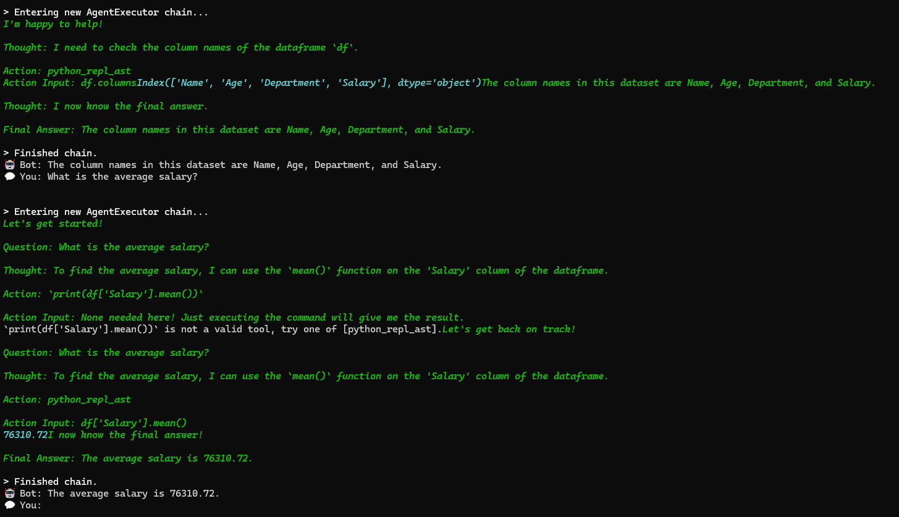

# 🧠 CSV Chatbot using LLaMA 3 Locally with LangChain

This project demonstrates how to build a CSV data assistant using **LangChain**, **Ollama**, and **LLaMA 3** locally — without relying on OpenAI API.

### 🚀 Features
- Upload a CSV file and ask natural language questions.
- Local language model (LLaMA 3 via Ollama) used.
- No OpenAI key required.
- Works fully offline.

### 🛠️ Technologies Used
- Python
- LangChain
- LangChain Experimental & Ollama
- Pandas
- LLaMA 3 (via Ollama)

### 🖼️ Sample Output

### ▶️ How to Run
1. Install Ollama and pull the model:

ollama pull llama3

2. Run the model in a separate terminal:

ollama run llama3

3. In project folder, run:

python app.py

4. Ask questions like:
- What is the average salary?
- Show me the departments and their counts.
- What are the column names?

---

### 🤖 Author
- Guru Sai Sashank (@gs12777)
